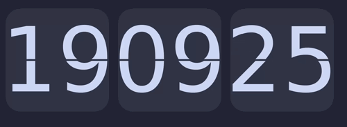
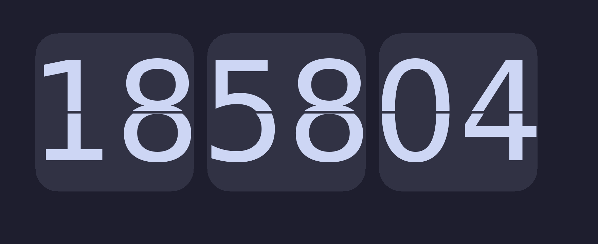
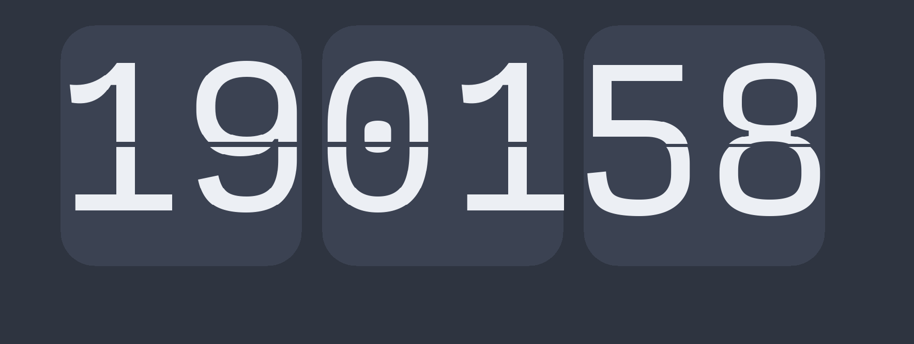
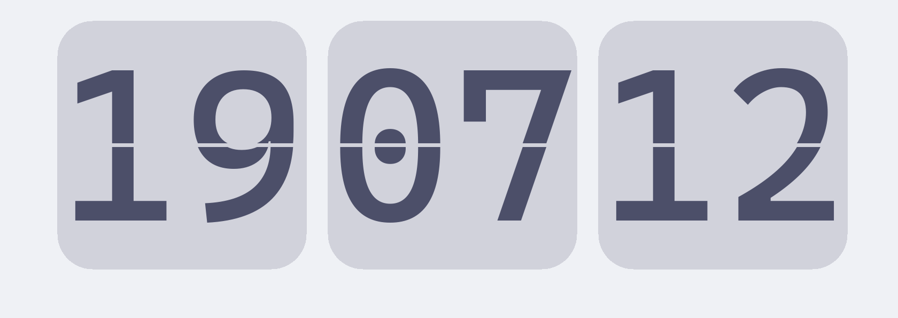

# Flip Clock

A stylish and configurable flip clock application built with Rust.



## Overview

A GPU-accelerated, highly customizable flip clock application written in Rust, inspired by [Gluqlo](https://github.com/alexanderk23/gluqlo) by Alexanderk23. The app features smooth animations and extensive theming options to match any desktop environment.

**Important Note:** This project has been primarily tested on Arch Linux. While it should work on other platforms, feedback and testing are highly appreciated!

## Features

* **Smooth Flip Animation:** Visually engaging card-flip animation when time updates
* **Customization:** Control colors, borders, animations.
* **Display Options:**
  * 12/24 hour time format
  * Optional seconds display
  * Leading zero toggle
  * AM/PM indicator
* **Window Management:**
  * Fullscreen mode
  * Configurable window dimensions
  * Close on any input

## Installation

### Prerequisites

* **Rust Toolchain:** Install from [rustup.rs](https://rustup.rs/)
* **SDL2 Libraries:**
  * **Debian/Ubuntu:** `sudo apt-get install libsdl2-dev libsdl2-ttf-dev`
  * **Arch Linux:** `sudo pacman -S sdl2 sdl2_ttf`
  * **Fedora/CentOS:** `sudo dnf install SDL2-devel SDL2_ttf-devel`
  * **macOS:** `brew install sdl2 sdl2_ttf`
  * **Windows:** Follow the [SDL2 installation guide](https://wiki.libsdl.org/Installation)

### Building from Source
If you are interested in making changes:
```bash
# Clone the repository
git clone https://github.com/NotAsBraveAsLancelot/flipclock-rs.git
cd flipclock-rs

# Build the project
cargo build --release

# Run the application
./target/release/flipclock-rs
```

### Installing With Cargo
If you just want to install the application, already have Cargo working on your system and want to try it out:
```bash
cargo install --git https://github.com/NotAsBraveAsLancelot/flipclock-rs
```

## Configuration

The application uses a TOML configuration file located at `~/.config/flipclock/config.toml`.

### Configuration Structure

```toml
# Example configuration
[theme]
background_color = "#1E1E2E"
card_color = "#313244"
card_border_color = "#CBA6F7"
card_border_size = 2
card_rounded_corners = true
card_gap = 8
number_color = "#CDD6F4"
font_path = "/usr/share/fonts/TTF/DejaVuSans.ttf"

[display]
show_seconds = true
show_ampm = false
show_leading_zero = true

[animation]
duration_ms = 400

[window]
fullscreen = true
close_on_any_input = true
```

## Theme Examples

### Catppuccin Mocha

```toml
[theme]
background_color = "#1E1E2E"
card_color = "#313244"
card_border_color = "#CBA6F7"
card_border_size = 2
card_rounded_corners = true
card_gap = 8
number_color = "#CDD6F4"
font_path = "/usr/share/fonts/TTF/JetBrainsMono-Bold.ttf"
```

### Nord

```toml
[theme]
background_color = "#2E3440"
card_color = "#3B4252"
card_border_color = "#88C0D0"
card_border_size = 2
card_rounded_corners = true
card_gap = 6
number_color = "#ECEFF4"
font_path = "/usr/share/fonts/TTF/InputMonoNerdFont-Regular.ttf"
```



### Catppuccin Latte

```toml
[theme]
background_color = "#eff1f5"
card_color = "#d1d2db"
card_border_color = "#babbf1"
card_border_size = 2
card_rounded_corners = true
card_gap = 7
number_color = "#4c4f69"
font_path = "/usr/share/fonts/TTF/CaskaydiaCoveNerdFont-Regular.ttf"
```


### Configuration Options

#### Theme

| Option | Type | Description | Default |
|--------|------|-------------|---------|
| `background_color` | String (hex) | Background color of the window | `"#0F0F0F"` |
| `card_color` | String (hex) | Color of the flip cards | `"#000000"` |
| `card_border_color` | String (hex) | Color of the card borders | `"#FFFFFF"` |
| `card_border_size` | Integer | Thickness of card borders in pixels | `2` |
| `card_rounded_corners` | Boolean | Whether cards have rounded corners | `true` |
| `card_gap` | Integer | Gap between cards in pixels | `5` |
| `number_color` | String (hex) | Color of the numbers | `"#FFFFFF"` |
| `font_path` | String | Path to TTF font file | `/usr/share/fonts/TTF/DejaVuSans.ttf` |

#### Display

| Option | Type | Description | Default |
|--------|------|-------------|---------|
| `show_seconds` | Boolean | Show seconds digits | `false` |
| `show_ampm` | Boolean | Show AM/PM indicator (12h format) | `false` |
| `show_leading_zero` | Boolean | Show leading zeros for hours | `false` |

#### Animation

| Option | Type | Description | Default |
|--------|------|-------------|---------|
| `enabled` | Boolean | Enable flip animation | `true` |
| `duration_ms` | Integer | Animation duration in milliseconds | `500` |

#### Window

| Option | Type | Description | Default |
|--------|------|-------------|---------|
| `width` | Integer | Window width in pixels | `1280` |
| `height` | Integer | Window height in pixels | `720` |
| `fullscreen` | Boolean | Run in fullscreen mode | `true` |
| `close_on_any_input` | Boolean | Close app on any key/mouse press | `false` |

## Usage

Simply run the application, and it will display the current time in the configured format. In the default configuration:

- Press `Esc`, `Space` or `Enter` to exit the application
- Press `F11` to toggle fullscreen mode
- If `close_on_any_input` is enabled, any key or mouse click will close the application

## Contributing

Contributions are welcome! Please feel free to submit a Pull Request.

## Acknowledgments

- [Gluqlo](https://github.com/alexanderk23/gluqlo) for the inspiration.
